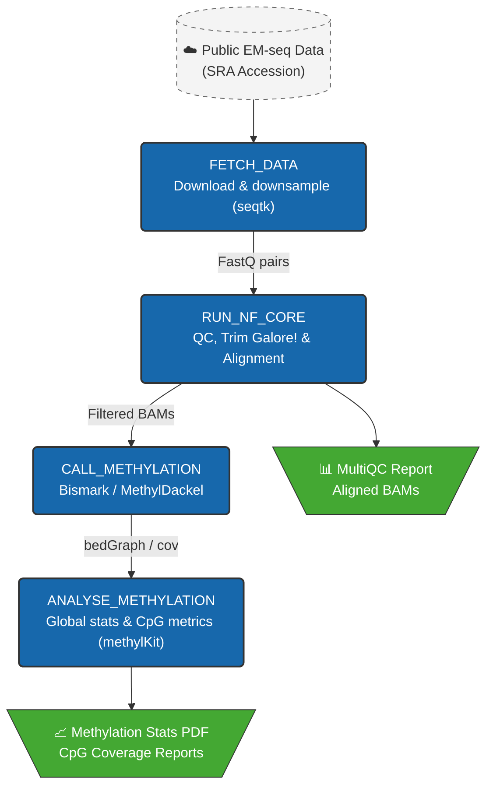

# 🧬 nf-emseq: Enzymatic Methyl-seq Analysis Pipeline
[](https://www.nextflow.io/)
[](https://nf-co.re/methylseq)
[](https://www.r-project.org/)

A pipeline for **whole genome methylation analysis** using enzymatic methyl-seq (EMseq) data. This repo showcases an end-to-end bioinformatics workflow from raw fastq acquisition to downstream differential methylation analysis using a public human reference dataset (NA12878).

EMseq is utilised here as an alternative to traditional bisulfite sequencing to preserve DNA integrity, yielding higher mapping efficiencies and less GC bias.

## Workflow Overview


1. **Data Acquisition**: Download and downsampling of NA12878 EM-seq data (SRX16351685).
2. **Core Pipeline**: Execution via `nf-core/methylseq` configured specifically for EMseq characteristics.
    * Quality control (`FastQC`, `MultiQC`)
    * Adapter trimming (`Trim Galore!`)
    * Alignment and methylation calling (`Bismark` & `MethylDackel`)
3. **Downstream Analysis**: R-based characterisation of global methylation patterns and CpG coverage.

## Repo structure
```
nf-emseq/
├── README.md
├── nextflow.config
├── run_pipeline.sh
├── bin/
│   ├── download_data.sh
│   └── analyse_methylation.R
└── envs/
    └── environment.yml
```

## Getting Started

### Prerequisites

Ensure you have Conda/Mamba and Nextflow installed. Clone the repository and activate the environment:

```bash
git clone [https://github.com/cemselb/nf-emseq.git](https://github.com/cemselb/nf-emseq.git)
cd nf-emseq
mamba env create -f envs/environment.yml
conda activate nf-emseq
```
